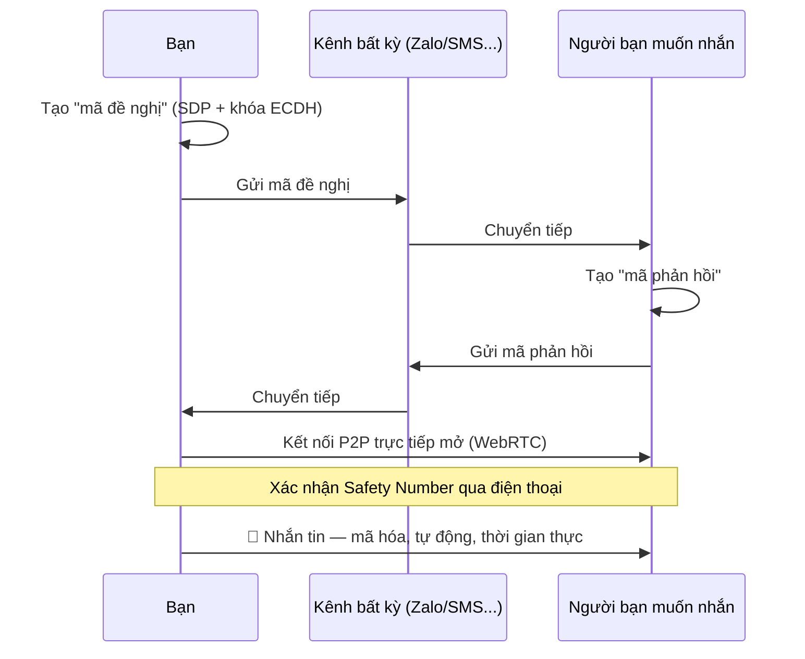
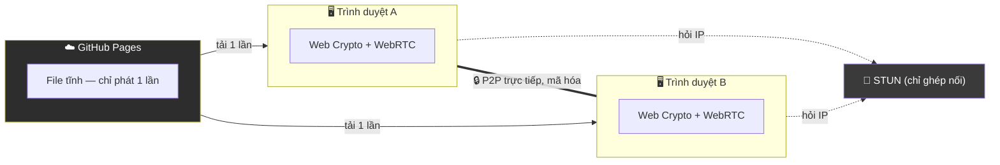

<div align="center">

# 🔐 anonymous-chat

### Nhắn tin mã hóa đầu-cuối. Không tài khoản. Không máy chủ. Không dấu vết.

Một web app **100% tĩnh**, chạy hoàn toàn trong trình duyệt của bạn —
mã hóa AES-256-GCM, trao đổi khóa qua ECDH, kết nối trực tiếp P2P qua
WebRTC, ngụy trang bản mã thành chuỗi emoji.

**Mã nguồn mở hoàn toàn — bạn không cần tin chúng tôi, chỉ cần đọc code.**

[](#-giấy-phép)
[](#-kiến-trúc)
[](#-kiến-trúc)
[](#-đặc-tả-mã-hóa)
[](#-minh-bạch--giới-hạn-thật)

[Demo trực tiếp](#) · [Báo lỗi](../../issues) · [Đóng góp](#-đóng-góp)

</div>

---

## 📖 Mục lục

- [Vì sao dự án này tồn tại](#-vì-sao-dự-án-này-tồn-tại)
- [Tính năng nổi bật](#-tính-năng-nổi-bật)
- [Cách hoạt động](#-cách-hoạt-động)
- [Kiến trúc](#-kiến-trúc)
- [Đặc tả mã hóa](#-đặc-tả-mã-hóa)
- [Bắt đầu nhanh](#-bắt-đầu-nhanh)
- [Minh bạch & giới hạn thật](#-minh-bạch--giới-hạn-thật)
- [Lộ trình](#-lộ-trình)
- [Đóng góp](#-đóng-góp)
- [Giấy phép](#-giấy-phép)

---

## 🎯 Vì sao dự án này tồn tại

Hầu hết app nhắn tin "riêng tư" trên thị trường đều bắt bạn **tin tưởng mù
quáng** vào 1 công ty: tin rằng họ mã hóa đúng cách, tin rằng họ không lưu
log, tin rằng server của họ không bị xâm nhập. Bạn không có cách nào tự
kiểm chứng.

**anonymous-chat đi theo hướng ngược lại:**

- Không có server nào để bị hack, bị yêu cầu giao nộp dữ liệu, hay bị đóng cửa.
- Không có tài khoản nào để bị rò rỉ.
- Không có công ty nào đứng giữa bạn và người bạn đang nhắn tin.
- Toàn bộ mã nguồn công khai — an toàn nằm ở **toán học**, không nằm ở
  **lòng tin**.

> *"Đừng tin, hãy kiểm chứng." — nguyên lý Kerckhoffs, 1883*

---

## ✨ Tính năng nổi bật

| | |
|---|---|
| 🔒 **Mã hóa đầu-cuối thật sự** | AES-256-GCM + ECDH P-256, chạy 100% trong trình duyệt bằng Web Crypto API chuẩn |
| ⚡ **Kết nối P2P trực tiếp** | WebRTC DataChannel — tin nhắn bay thẳng giữa 2 máy, không qua bất kỳ máy chủ nào |
| 🎭 **Ngụy trang bằng Emoji** | Bản mã hiển thị dưới dạng chuỗi emoji — gửi qua bất kỳ kênh nào bạn muốn |
| 🕵️ **Không tài khoản, không đăng ký** | Mở trình duyệt, dùng ngay — không email, không số điện thoại |
| 🔄 **Forward Secrecy** | Ratchet tự động đổi khóa từng tin nhắn — lộ 1 khóa không lộ toàn bộ lịch sử |
| 🛡️ **Xác thực chống MITM** | Safety Number bắt buộc xác nhận trước khi gửi tin đầu tiên |
| 🌍 **11 ngôn ngữ** | Việt, Anh, Nhật, Hàn, Ả Rập, Nga, Pháp, Trung, Ba Tư, Ukraina, Đức — kể cả RTL |
| 📦 **Zero dependency** | Không 1 dòng thư viện ngoài trong runtime — mọi thứ tự viết, tự kiểm soát |
| 💻 **Chạy khắp nơi** | GitHub Pages, mở file HTML trực tiếp, hay tự host — đều được |

---

## 🚀 Cách hoạt động



1. **Trao đổi 1 lần duy nhất** — gửi "mã đề nghị", nhận lại "mã phản hồi" qua bất kỳ kênh nào (Zalo, SMS, email...)
2. **Xác nhận danh tính** — đọc to mã Safety Number 8 ký tự qua điện thoại, chống bị đánh tráo giữa đường
3. **Chat trực tiếp** — mọi tin nhắn sau đó bay thẳng qua kết nối P2P, tự động mã hóa, không cần thao tác gì thêm

---

## 🏗️ Kiến trúc



**Không có backend. Không có database. Không có ai đứng giữa cuộc trò
chuyện của bạn.** GitHub Pages chỉ làm đúng 1 việc: phát file 1 lần lúc bạn
mở trang — sau đó hoàn toàn đứng ngoài cuộc.

| Thành phần | Vai trò |
|---|---|
| `crypto/` | AES-GCM, PBKDF2, ECDH, HKDF ratchet, bit-packing emoji |
| `webrtc/` | Bắt tay, quản lý kết nối P2P, tự phát hiện rớt mạng |
| `qr/` | Mã hóa/giải mã trực quan (tùy chọn, không bắt buộc) |
| `i18n/` | 11 ngôn ngữ, hỗ trợ đầy đủ RTL |

---

## 🔬 Đặc tả mã hóa

<div align="center">

| Thông số | Giá trị |
|---|---|
| Cipher | `AES-256-GCM` |
| Trao đổi khóa | `ECDH P-256` |
| KDF (chế độ passphrase) | `PBKDF2-HMAC-SHA256` — 250.000 vòng |
| Forward secrecy | Ratchet đối xứng qua `HKDF-SHA256`, tách khóa theo hướng |
| Padding | Bội số cố định, chống lộ độ dài tin thật |
| Ngẫu nhiên | `crypto.getRandomValues()` — không bao giờ `Math.random()` |

</div>

Mọi phép toán chạy bằng **Web Crypto API chuẩn native của trình duyệt** —
không tự chế thuật toán mã hóa lõi nào. Phần tự viết (ratchet, bit-packing
emoji, mã bắt tay) được cô lập rõ ràng và ưu tiên review kỹ nhất.

---

## ⚡ Bắt đầu nhanh

**Không cần cài đặt gì cả** — đây là web app tĩnh:

```bash
# Clone về máy
git clone https://github.com/<user>/anonymous-chat.git
cd anonymous-chat

# Mở trực tiếp — không cần server, không cần build
open index.html
```

Hoặc chỉ cần vào thẳng bản deploy trên GitHub Pages. Muốn tự host bản của
riêng bạn? Bật GitHub Pages trong Settings của repo bạn fork — xong, không
cần cấu hình gì thêm.

---

## 🔍 Minh bạch & giới hạn thật

> Dự án này tin rằng **thành thật về giới hạn** đáng tin hơn nhiều so với
> những lời quảng cáo "bảo mật tuyệt đối". Đọc kỹ phần này trước khi dùng
> cho nội dung thực sự nhạy cảm.

- 🟡 **Chưa qua audit bảo mật độc lập bởi con người.** Dự án đã tự chạy
  self-audit (xem [`SELF-AUDIT.md`](./SELF-AUDIT.md)) và đang khắc phục các
  phát hiện — nhưng đây **không thay thế** được review bởi chuyên gia bảo
  mật thật sự.
- 🟡 **Địa chỉ IP lộ cho đối phương** khi kết nối P2P (bản chất của WebRTC),
  và **STUN server công khai thấy IP 2 bên** lúc ghép nối. Cần ẩn danh
  tuyệt đối? [Dùng qua Tor Browser](#) — xem hướng dẫn trong app.
- 🟡 **Chỉ bảo vệ nội dung, không bảo vệ metadata** — ai đó theo dõi được
  mạng vẫn biết *có* cuộc trò chuyện diễn ra, dù không đọc được nội dung.
- 🟡 **Ratchet đơn giản hóa**, không phải Double Ratchet đầy đủ như Signal.
- 🟢 **Không lưu trữ tin nhắn, không lưu khóa trần trụi** — tải lại trang
  cần bắt tay lại (đây là thiết kế cố ý, không phải lỗi).

**An toàn không phải trạng thái tĩnh — đây là quá trình liên tục.** Nếu
bạn tìm thấy lỗ hổng, [mở issue](../../issues) hoặc gửi PR — mọi đóng góp
về bảo mật đều được ưu tiên xem xét nhanh nhất.

---

## 🗺️ Lộ trình

- [x] Lõi mã hóa AES-GCM + ECDH + Ratchet
- [x] Kết nối P2P qua WebRTC + STUN
- [x] Mã hóa hiển thị bằng Emoji
- [x] Đa ngôn ngữ (11 thứ tiếng, hỗ trợ RTL)
- [x] Self-audit vòng 1 — khắc phục lỗi nghiêm trọng
- [ ] Giao diện thiết kế lại (glassmorphism, mobile-first)
- [ ] QR code chuẩn — quét bằng camera thật
- [ ] Giữ phiên qua reload (tùy chọn, mã hóa bằng PIN cục bộ)
- [ ] Audit bảo mật độc lập bởi bên thứ 3

---

## 🤝 Đóng góp

Mọi đóng góp đều được chào đón — đặc biệt là:

- 🐛 Báo lỗi bảo mật (xem cách báo cáo có trách nhiệm bên dưới)
- 🌐 Cải thiện bản dịch cho 11 ngôn ngữ hiện có
- 🎨 Cải thiện giao diện, trải nghiệm người dùng
- 📖 Cải thiện tài liệu, làm rõ hơn cho người không rành kỹ thuật

**Báo lỗi bảo mật:** nếu phát hiện lỗ hổng nghiêm trọng, vui lòng **không**
mở issue công khai ngay — liên hệ riêng trước để có thời gian khắc phục,
tránh bị lợi dụng trước khi có bản vá.

---

## 📜 Giấy phép

Phát hành theo giấy phép **MIT** — dùng, sửa, phân phối lại tự do, miễn
giữ nguyên thông báo bản quyền gốc. Xem chi tiết tại [`LICENSE`](./LICENSE).

---

<div align="center">

**Được xây dựng với niềm tin rằng quyền riêng tư không nên là đặc quyền.**

Nếu dự án này hữu ích, hãy để lại 1 ⭐ — nó thực sự giúp dự án được nhiều
người biết đến hơn.

</div>
- Manual passphrase messages are self-contained and do not have cross-message forward secrecy.
- Messages more than 1,000 ratchet positions ahead are refused to limit denial-of-service work. Old or out-of-order messages cannot be opened after their keys are destroyed.
- There is no TURN server. Strict NATs and firewalls can prevent or break direct connections. Manual emoji transport remains available.
- The visual matrix module is experimental and not standards-compatible QR. See the previous section.
- The application protects content, not traffic metadata. External channels can still reveal who contacted whom and when.
- GitHub Pages serves the application files. A compromised host or deployment could serve modified JavaScript. Review pinned source and deployment controls for high-risk use.

### IP disclosure for WebRTC

Direct P2P networking necessarily reveals your IP address to the other person. Google's public STUN server at `stun:stun.l.google.com:19302` sees both parties' IP addresses during ICE gathering. STUN helps discover a route and does not relay or store message content.

If you need to hide your IP from the other person, use an appropriate VPN or privacy network before opening the app and verify that your chosen browser supports the intended WebRTC behavior. Tor Browser may restrict WebRTC. The fully manual passphrase and manual fallback paths do not initiate STUN or WebRTC networking.

## Session hygiene

- No service worker or web app manifest is present.
- The privacy banner recommends a private browsing window.
- “Clear session” uses a two-step confirmation, zeroizes reachable in-memory byte arrays, closes the peer, and removes all `localStorage`, including locale choice, contact metadata, ratchet positions, and OTP offsets.
- Conversation keys and plaintext are never persisted. Reloading or clearing requires a fresh direct-chat handshake; clearing OTP offsets also prevents safe continuation with previously consumed key-file regions unless both parties replace the key file.

## Internationalization

Locale files exist for English, Vietnamese, Japanese, Korean, Arabic, Russian, French, Simplified Chinese, Persian, Ukrainian, and German. English is the complete fallback vocabulary. Arabic and Persian set `dir="rtl"`; layout CSS uses logical inline/block properties where direction matters.

## Deploy to GitHub Pages

1. Push the repository to GitHub.
2. Open **Settings > Pages**.
3. Under **Build and deployment**, select **Deploy from a branch**.
4. Select the branch and repository root, then save.
5. Open the HTTPS Pages URL and test both manual encryption and a two-browser WebRTC handshake.
6. Keep repository Pages settings, branch protection, and maintainer accounts secured. A static cryptographic app inherits the integrity of every deployed JavaScript file.

Do not add a service worker, PWA manifest, third-party analytics, CDN import, signaling backend, or hidden network request without revisiting the security model and documentation.

## Interface design and implementation notes

The August 2026 interface rebuild separates the product into a public landing view and a focused encryption workspace. The visual direction is a dark technical field with one violet-to-cyan accent, restrained semantic status colors, large editorial type on the landing view, and denser controls inside the workspace. Dark is the default and a local light-theme preference is available.

The workspace keeps the existing direct-chat, passphrase, and one-time-pad workflows. On wide screens, local contact metadata and mode navigation sit beside the active tool. A connected conversation adds a dedicated security panel. On narrow screens, modes become a compact top rail, forms become one column, and the composer stays near the bottom safe area.

Important behavior:

- Sending is disabled in the DOM and checked again in the submit handler until the user confirms that the safety numbers match.
- Direct, manual fallback, and unverified states use a label, symbol, and color instead of color alone.
- Page and mode changes use the native View Transition API when available. The update remains immediate without it.
- Landing reveals use one `IntersectionObserver`. Ambient motion and message entry animate only `transform` and `opacity`.
- `prefers-reduced-motion` removes non-essential animation. `prefers-reduced-transparency` and coarse-pointer/mobile rules replace blur with a solid surface.
- Controls have a minimum 44 pixel target. Layout uses logical properties and retains right-to-left behavior for Arabic and Persian.
- The 69.8 KB Geist Sans variable WOFF2 file is self-hosted under `fonts/`. Safety numbers and ciphertext continue to use the system monospace stack, avoiding a second font download.

### Performance check

The page was served locally and captured with installed Chrome at 1440 x 1000 and 390 x 844 viewports. This caught and fixed a mobile overflow, an incorrect landing-only control state, and a missing color-emoji fallback. The application remains dependency-free and has no runtime image, framework, analytics, or third-party font request. Mobile disables `backdrop-filter`, which removes the most expensive glass effect from coarse-pointer and narrow screens.

This environment did not provide Android hardware or a reliable DevTools CPU-throttling trace. Therefore no mid-range Android frame-rate or 4x/6x CPU claim is made. Before a production release, run Chrome DevTools Performance at 4x or 6x CPU slowdown on the landing reveal, workspace switch, long message list, and open composer, then record long tasks and dropped frames.

### Deliberate compromises

- The existing `qr/` matrix is experimental and is not a standards-compatible, camera-ready QR flow. The interface does not advertise a scanner or render a fake QR action. Offer and answer codes remain the honest onboarding path.
- English is the complete fallback catalog and Vietnamese covers the complete visible landing/workspace interface. The other nine non-English catalogs retain their existing translated core encryption flows and use English fallback for new landing copy. Completing those translations needs native-speaker review; the UI does not silently omit any label.
- The repository has no configured public GitHub URL, so the footer links to local project documentation and the security self-audit instead of inventing an external source link.

### Optional reload persistence

Reload persistence is off by default and can be enabled from Advanced settings. The PIN option derives an AES-256-GCM key with PBKDF2-SHA-256 using 100,000 iterations; only the encrypted current ratchet snapshot is stored, and five failed unlock attempts delete it. The browser-held option stores a non-extractable AES-GCM `CryptoKey` in IndexedDB and keeps only the encrypted snapshot beside it.

Neither option stores plaintext, message history, message keys, or a raw chain key. A live `RTCPeerConnection` cannot survive a reload, so a restored session resumes through the manual encrypted-emoji fallback until the peers complete a new reconnect handshake. A compromised browser, injected script, screenshots, or an unlocked device remain outside this feature's protection.

## Repository map

```text
crypto/     Web Crypto wrappers, ratchet, OTP, emoji codec and generated table
webrtc/     manual handshake envelopes, peer connection and fallback state
qr/         deferred experimental visual matrix, not a camera-ready QR implementation
i18n/       11 locale files
scripts/    build-time emoji table generator
tests/      dependency-free Node tests, including self-audit regressions
```
